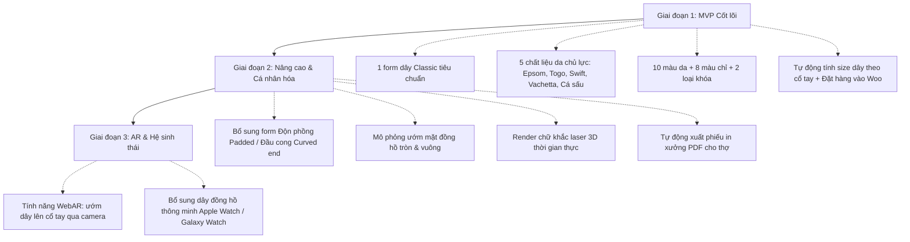

# BẢN PHÂN TÍCH TOÀN DIỆN: XÂY DỰNG WEB APP 3D CUSTOM WATCH STRAP CHO DÂY DA PERCENT (SHOPDONGHO.COM)
> **Mục tiêu nghiên cứu:** Phân tích quy trình, cấu trúc tính năng và toàn bộ danh mục đầu vào (3D assets, dữ liệu vật liệu, logic tính giá, kiến trúc công nghệ) từ case study **Handdn.com** để thiết kế và triển khai giải pháp 3D Customizer cho thương hiệu **Dây da Percent** trên hệ thống **shopdongho.com**.
> **Ngày lập:** 06/10/2026
> **Người thực hiện:** Antigravity / Anh Pham Agency

---

## 1. MỔ XẺ CASE STUDY: CÔNG CỤ 3D CỦA HANDDN.COM

Handdn (thương hiệu đồ da thủ công xuất khẩu từ Đà Nẵng) đã tạo ra bước đột phá khi ra mắt **3D Custom Watch Strap Platform** (`handdn.com/product/3d-custom-watch-strap/`). Đây là công cụ 3D configurator tương tác thời gian thực dành cho dây da đồng hồ bespoke, giải quyết bài toán cốt lõi của ngành may đo thủ công: **khách hàng không hình dung được sản phẩm thực tế khi phối màu da, màu chỉ, dáng mũi và độn phồng**.

### 1.1. Cấu trúc 12 bước cấu hình của Handdn
Qua rà soát quy trình của Handdn, công cụ được phân bổ theo 12 bước tuyến tính (Stepper UI):
1. **Step 1 - Select the Material (Chất liệu da & Màu sắc):** Hơn 30 loại da (Alligator, Epsom, Togo, Swift, Barenia, Alran Chevre, Saffiano, Canvas...) với hàng trăm màu sắc.
2. **Step 2 - Choose the Lining (Da lót mặt sau):** Mặc định là da Zermatt Pháp (chống thấm mồ hôi, chống dị ứng), hoặc tùy chọn da Box Calf, da dê Alran Chevre...
3. **Step 3 - Set the Curved End (Đầu nối lug):** Lựa chọn giữa đầu thẳng tiêu chuẩn (Straight end) hoặc đầu uốn cong ôm sát vỏ đồng hồ (Curved end).
4. **Step 4 - Define the Measurements (Kích thước & Độ dài):**
   - Chiều rộng bản dây (Lug width - Buckle width, vd: 20-18mm, 22-20mm, 19-16mm...).
   - Chiều dài dây (Dây ngắn x Dây dài tính theo chu vi cổ tay và kích thước lug-to-lug của đồng hồ).
5. **Step 5 - Choose the Padding Style (Kiểu độn form):** Độn phồng giữa (Padded), phẳng mỏng (Flat), độn bậc (Half-padded), đục lỗ Rally...
6. **Step 6 - Adjust Strap Thickness (Độ dày bản dây):** Chỉnh độ dày từ phần đầu lug xuống đuôi khóa (vd: 4.5mm dốc dần về 2.2mm).
7. **Step 7 - Select the Tip Shape (Dáng đuôi dây):** Đuôi nhọn truyền thống (Pointed), đuôi bo tròn (Round), đuôi vát thuyền (Boat), đuôi vuông (Square).
8. **Step 8 - Customize the Stitching (Đường may & Chỉ):**
   - 5 kiểu may: May kín viền (Full stitch), may viền hở đầu (Open/Minimal stitch), may 2 mũi phong cách cổ điển (Side/Vintage stitch), may đôi (Double stitch)...
   - ~30 màu chỉ may (tiệp màu da hoặc tạo điểm nhấn tương phản).
9. **Step 9 - Choose Edge Finishing (Sơn cạnh / Viền):** Màu sơn cạnh (Edge paint) tiệp màu hoặc đối lập, kiểu bóng hoặc mờ.
10. **Step 10 - Select Spring Bars (Chốt dây):** Chốt lò xo tiêu chuẩn hoặc chốt thông minh tháo nhanh (Quick-release pins).
11. **Step 11 - Choose the Buckle (Khóa dây):** Khóa kim (Tang buckle), Khóa bướm gập chống gãy dây (Deployant clasp) với 4 màu xi mạ (Bạc Inox, Vàng Gold, Vàng hồng Rose Gold, Đen PVD).
12. **Step 12 - Add Personalization & Notes (Cá nhân hóa & Ghi chú):** Khắc tên/chữ laser lên mặt lót, lưu ý kích thước đặc biệt.

### 1.2. Tính năng phụ trợ mang tính quyết định chuyển đổi của Handdn
- **Watch Case Pairing Simulator:** Người dùng được chọn mặt đồng hồ giả lập (Tròn/Vuông), màu vỏ (Bạc, Vàng, Vàng hồng, Đen), màu dial (Đen, Trắng, Xanh navy...) để ướm thử cùng bộ dây đang thiết kế.
- **Xoay lật 360 độ:** Xem rõ mặt ngoài, góc nghiêng độn phồng và mặt lót bên trong.
- **Độ chân thực đạt 90–95%:** Ứng dụng PBR (Physically Based Rendering) mô phỏng chính xác ánh sáng, độ bóng mờ của da và vân sần 3D.

---

## 2. BỐI CẢNH VÀ ĐỊNH VỊ CHO DÂY DA PERCENT (SHOPDONGHO.COM)

### 2.1. Thực trạng thương hiệu Percent hiện tại
- **Mô hình hiện tại:** Bán dây may sẵn (Ready-to-wear - RTW) với hơn **1.214 SKU**, ~115 model (Agon, Leo, Cosimo, Hoff, Karl, Bruno...).
- **Chất liệu sẵn có:** 32+ loại da (Epsom, Togo-Weinheimer, Swift, Vachetta, Cá sấu, Kỳ đà, Nappa, Saffiano, Box Calf...).
- **Hệ màu sẵn có:** 19 nhóm màu chính thức (Đen, Nâu, Nâu đỏ, Nâu vàng, Be, Etoupe, Xám, Trắng, Đỏ, Cam, Vàng, Hồng, Tím, Xanh navy, Xanh dương, Xanh xám, Xanh rêu, Xanh lá, Xanh bơ).
- **Phân khúc giá:** Dây may sẵn dao động 500.000₫ – 700.000₫.
- **Nền tảng kỹ thuật:** WordPress + WooCommerce + Flatsome (chạy sau Cloudflare).

### 2.2. Mục tiêu chiến lược khi đưa 3D Customizer vào shopdongho.com
1. **Nâng tầm giá trị thương hiệu Percent:** Tách riêng dòng **"Percent Bespoke / Made to Order"** (giá 800.000₫ – 1.800.000₫ tùy chất liệu da cá sấu/da Ý cao cấp) song song với dòng may sẵn 500k–700k.
2. **Khắc phục điểm nghẽn bán hàng:** Khách hàng sở hữu đồng hồ đặc thù (cổ tay quá nhỏ 14cm hoặc quá to 19cm; size lug lẻ như 19mm, 21mm; hoặc muốn phối chỉ tone-sur-tone với kim đồng hồ) hiện nay nhân viên tư vấn phải chat Zalo/Facebook rất lâu và dễ bị nhầm thông số.
3. **Chuẩn hóa thông tin đưa xuống xưởng chế tác:** Khi đơn hàng hoàn tất qua web 3D, xưởng Percent nhận được phiếu kỹ thuật tự động (kèm hình ảnh render 3D mô phỏng của chính khách), loại bỏ 100% rủi ro thợ may nhầm màu chỉ hay sai size.

---

## 3. DANH MỤC ĐẦU VÀO CẦN THIẾT ĐỂ BUILD WEB APP (INPUTS & ASSETS)

Để triển khai được một hệ thống 3D Customizer mượt mà, chân thực và tích hợp liền mạch vào shopdongho.com, cần chuẩn bị đầy đủ 5 nhóm đầu vào sau:

### NHÓM 1: ĐẦU VÀO 3D & VẬT LIỆU ĐỒ HỌA (3D ASSETS & PBR MATERIALS)
*Đây là nhóm đầu vào quan trọng nhất, quyết định 80% cảm xúc thị giác của người dùng.*

1. **Bộ mô hình 3D (3D Geometry / Meshes) định dạng `.glb` / `.gltf`:**
   - **Thân dây (Strap Bodies):**
     - Dây ngắn (Short/Buckle strap) & Dây dài (Long/Tail strap).
     - **Morph Targets (Blendshapes) hoặc Model riêng cho từng kiểu dáng:**
       - Kiểu form: Phẳng (Flat) vs Độn phồng sống trâu (Padded) vs Độn bậc.
       - Kiểu đuôi dây: Đuôi nhọn (Pointed), Đuôi tròn (Round), Đuôi thuyền (Boat).
       - Kiểu đầu lug: Đầu thẳng (Straight) vs Đầu cong ôm vỏ (Curved end).
   - **Phụ kiện kim loại (Hardware):**
     - Con đỉa cố định (Fixed keeper) & Con đỉa di động (Floating keeper).
     - Khóa kim tiêu chuẩn (Tang buckle) & Khóa bướm bấm gập (Deployant clasp).
     - Chốt thông minh (Quick release spring bars có gạt nhỏ lồi ra ở mặt sau).
   - **Mặt đồng hồ giả lập (Reference Watch Cases):**
     - 1 vỏ tròn (Round case 40mm) & 1 vỏ vuông (Square/Tank case).
     - Mặt số tối giản (kim, vạch số) tách riêng vật liệu để đổi màu vỏ (Bạc, Vàng, Vàng hồng, Đen).
2. **Bộ Texture PBR (Physically Based Rendering) cho từng chất liệu da Percent:**
   *Để da trên 3D nhìn như da thật, không thể chỉ tô màu hex, mà bắt buộc phải có bản đồ vật liệu PBR (kích thước 2048x2048px hoặc 1024x1024px tối ưu WebP):*
   - **Albedo / Base Color Map:** Màu sắc và hoa văn tự nhiên của da.
   - **Normal Map (Bản đồ pháp tuyến):** Cực kỳ cốt lõi! Tạo chiều sâu lồi lõm thực tế:
     - Vân Epsom: các đường dập chéo hạt chìm.
     - Vân Togo: các hạt tròn tự nhiên không đều.
     - Vân Cá sấu: vân vảy vuông lớn ở bụng hoặc vân vảy tròn ở hông.
     - Vân Saffiano: đường chéo đan hình chữ thập đặc trưng.
     - Vân Swift / Nappa: bề mặt siêu mịn, hạt cực nhỏ.
   - **Roughness Map:** Quy định độ bóng/lì của da (da mộc lì ánh sáng tán xạ, da bóng bắt sáng viền).
   - **Ambient Occlusion (AO) Map:** Tạo bóng tối ở các kẽ rãnh, đường chỉ may và mép viền.
3. **Mô hình đường chỉ may (Stitching):**
   - Tách riêng mesh đường chỉ nổi chạy quanh viền dây để có thể đổi màu shader theo bảng màu chỉ của Percent (trắng, đen, kem, vàng bò, xanh navy...).

---

### NHÓM 2: DỮ LIỆU KỸ THUẬT & QUY CHUẨN XƯỞNG MAY (CRAFT RULES & LOGIC)
1. **Ma trận tương thích (Feasibility Matrix):**
   - Loại da nào cho phép làm Padded (độn), loại da nào chỉ làm Flat (ví dụ da dày hoặc da vân cứng).
   - Dáng đuôi nào đi được với loại khóa nào.
2. **Bảng quy đổi kích thước may đo (Measurement Formulas):**
   - Công thức: `Chu vi cổ tay = Độ dài dây ngắn + Độ dài dây dài - Khoảng cách chốt - Chiều dài vỏ đồng hồ (Lug-to-lug)`.
   - Các bảng size tiêu chuẩn:
     - Cổ tay nhỏ (140 - 160mm): Dây 105/65mm hoặc 110/70mm.
     - Cổ tay vừa (160 - 180mm): Dây 115/75mm hoặc 120/80mm (chuẩn người Việt).
     - Cổ tay lớn (180 - 200mm): Dây 125/85mm.
   - Danh sách size lug thông dụng tại shopdongho.com: 18-16mm, 19-16mm, 20-18mm, 21-18mm, 22-20mm, 24-22mm.
3. **Danh mục nguyên vật liệu thực tế của xưởng Percent:**
   - Bảng mã da đang trữ sẵn trong kho.
   - Bảng 10-15 màu chỉ may sáp cao cấp (Meisi / Galaces).
   - Bảng 8-10 màu sơn cạnh (Fenice / Giardini).

---

### NHÓM 3: BẢNG GIÁ ĐỘNG (DYNAMIC PRICING ENGINE)
Công thức tính giá minh bạch realtime khi người dùng click chọn:
$$\text{Tổng giá} = \text{Giá nền da cơ bản} + \Delta\text{Chất liệu} + \Delta\text{Kiểu may/Độn} + \Delta\text{Khóa} + \Delta\text{Cá nhân hóa}$$

*Ví dụ khung giá đề xuất cho Percent Bespoke:*
- **Base Price (Da bò Ý cao cấp Togo / Epsom / Swift, khóa kim inox tiêu chuẩn, lót Zermatt):** 790.000₫ – 890.000₫.
- **Phụ phí nâng cấp da:**
  - Da Kỳ đà (Lizard): +500.000₫.
  - Da Đà điểu (Ostrich): +600.000₫.
  - Da Cá sấu Alligator / Crocodile: +900.000₫ – 1.200.000₫.
- **Phụ phí cấu hình:**
  - Khóa bướm chống gãy dây (Deployant clasp): +150.000₫ – 250.000₫.
  - Chốt thông minh Quick-release: +50.000₫ (hoặc miễn phí làm quà tặng).
  - Khắc tên / ngày kỷ niệm theo yêu cầu bằng laser: +50.000₫.

---

### NHÓM 4: THIẾT KẾ GIAO DIỆN & TRẢI NGHIỆM (UI/UX DESIGN SYSTEM)
1. **Tone & Style:**
   - Thừa hưởng bộ nhận diện thương hiệu Percent đã chuẩn hóa: Nền kem trang nhã (`#F6F0E5`), màu nhấn nâu Espresso (`#241813`) / Cognac (`#9C5A2C`), vàng Gold nhạt, font chữ tiếng Việt chuẩn **Be Vietnam Pro**.
   - Phong cách tối giản, sang trọng chuẩn Atelier thủ công (Luxury Craftsman).
2. **Bố cục giao diện (Layout):**
   - **Desktop (Chia 2 cột):** Cột trái là Canvas 3D tương tác lớn chiếm 60% màn hình; Cột phải là bảng điều khiển (Accordion / Stepper 5-6 bước) chiếm 40% màn hình, thanh tóm tắt giá và nút "Đặt may" ghim cố định ở đáy.
   - **Mobile (Ưu tiên hàng đầu):** Màn hình 3D chiếm 55% nửa trên; Nửa dưới là Drawer trượt các tab tùy chọn (Chất liệu > Kích thước > Chỉ may > Khóa > Khắc tên).
3. **Controls 3D thân thiện:**
   - Nút xoay nhanh: "Mặt trước", "Mặt sau", "Nhìn nghiêng", "Ướm với đồng hồ".
   - Nút phóng to / thu nhỏ chi tiết hạt da và đường may.

---

### NHÓM 5: TÍCH HỢP KỸ THUẬT VÀO HỆ THỐNG SHOPDONGHO.COM
1. **Kiến trúc ứng dụng Web (Tech Stack):**
   - **3D Engine:** **React Three Fiber (R3F) + Drei** (dựa trên Three.js) – Đây là stack tiêu chuẩn công nghiệp hiện đại nhất, cho phép quản lý state các tùy chọn mượt mà, tối ưu hiệu năng WebGL và tải texture bất đồng bộ (lazy-loading).
   - **3D Compression:** Nén file 3D bằng công nghệ **Draco / Meshopt** và nén texture bằng **KTX2 / WebP** để dung lượng toàn bộ scene 3D < 3.5MB, tải dưới 2 giây trên mạng 4G.
2. **Kịch bản nhúng vào WooCommerce / Flatsome:**
   - **Phương án tối ưu:** Build dưới dạng một Single Page App (SPA) độc lập nhúng vào một template trang riêng (vd: `shopdongho.com/percent-3d-custom/` hoặc subdomain `custom.shopdongho.com`).
   - **Quy trình kết nối Giỏ hàng (Cart Flow):**
     1. Khách cấu hình xong -> App tự chụp 1 ảnh snapshot góc đẹp nhất từ Canvas (Base64 JPEG/WebP) làm ảnh đại diện.
     2. Đóng gói toàn bộ cấu hình vào payload JSON:
        ```json
        {
          "leather_type": "Togo Weinheimer",
          "color": "Nâu Đất (Soil)",
          "lining": "Zermatt Pháp Chống Mồ Hôi",
          "lug_size": "20-18mm",
          "wrist_size": "165mm",
          "padding": "Padded (Độn phồng)",
          "stitch_style": "Full Stitch",
          "stitch_color": "Chỉ kem vintage",
          "buckle": "Khóa bướm vàng hồng",
          "engraving": "TUAN ANH 1994",
          "custom_price": 1140000,
          "preview_image_url": "..."
        }
        ```
     3. Gọi AJAX vào WooCommerce thêm 1 sản phẩm ảo đại diện ("Dây da Percent May Đo 3D") với Custom Line Item Meta tương ứng.
     4. Chuyển hướng người dùng thẳng tới trang Checkout quen thuộc của shopdongho.com.

---

## 4. LỘ TRÌNH TRIỂN KHAI PHÙ HỢP CHO SHOPDONGHO (3 GIAI ĐOẠN)

Để tránh đầu tư dàn trải và quá tải cho xưởng chế tác, nên triển khai theo mô hình MVP (Minimum Viable Product):



---

## 5. BẢNG CHECKLIST NGUYÊN VẬT LIỆU CẦN CHUẨN BỊ TRƯỚC (ACTION ITEMS)

| STT | Hạng mục cần chuẩn bị | Bên phụ trách | Chi tiết cụ thể |
|---|---|---|---|
| **1** | Mẫu vật lý & Chụp ảnh Texture da | Xưởng Percent / Nhiếp ảnh | Chụp macro phẳng độ phân giải cao (Flat scan/photogrammetry) các dòng da chủ lực (Togo, Epsom, Cá sấu...) để tạo Normal Map chân thực. |
| **2** | 3D Modeling cơ sở | 3D Artist | Dựng 1 cặp dây mẫu (Dây ngắn + Dây dài) + Khóa kim + Khóa bướm chuẩn tỉ lệ mm; UV unwrap sạch sẽ để map texture không bị méo. |
| **3** | Bảng quy chuẩn xưởng may | Trưởng xưởng Percent | Bảng kích thước dây tiêu chuẩn, bảng mã màu chỉ, các giới hạn kỹ thuật may đo. |
| **4** | Công thức định giá Bespoke | Phòng Kinh doanh / Anh | Bảng giá base cho từng loại da và giá chênh lệch của các option phụ kiện. |
| **5** | Code Prototype 3D & UI | Web Dev (Anh Pham Agency) | Xây dựng core 3D viewer bằng React Three Fiber, tối ưu ánh sáng (Studio Lighting setup) để da lên màu đúng mắt nhìn thật. |

---

## 6. KẾT LUẬN & ĐỀ XUẤT HƯỚNG ĐI

Công cụ của **Handdn** rất thành công vì biến việc đặt dây da từ một cuộc trò chuyện dài dòng, dễ nhầm lẫn thành một **trải nghiệm giải trí trực quan cao cấp**. 

Đối với **Percent bên shopdongho.com**, chúng ta có lợi thế cực lớn:
- Đã có sẵn xưởng chế tác 18 bước thủ công.
- Đã có nguồn da Ý phong phú và uy tín tại chuỗi showroom.
- Đã có nền tảng web WooCommerce vận hành ổn định.

**Đề xuất tiếp theo:** Bắt đầu bằng việc dựng **Bản thử nghiệm tương tác (Interactive 3D Prototype MVP)** với 1 mẫu dây chuẩn, 3 loại da và 5 màu sắc để nghiệm thu chất lượng hiển thị và trải nghiệm trước khi mở rộng toàn bộ bảng nguyên liệu.
